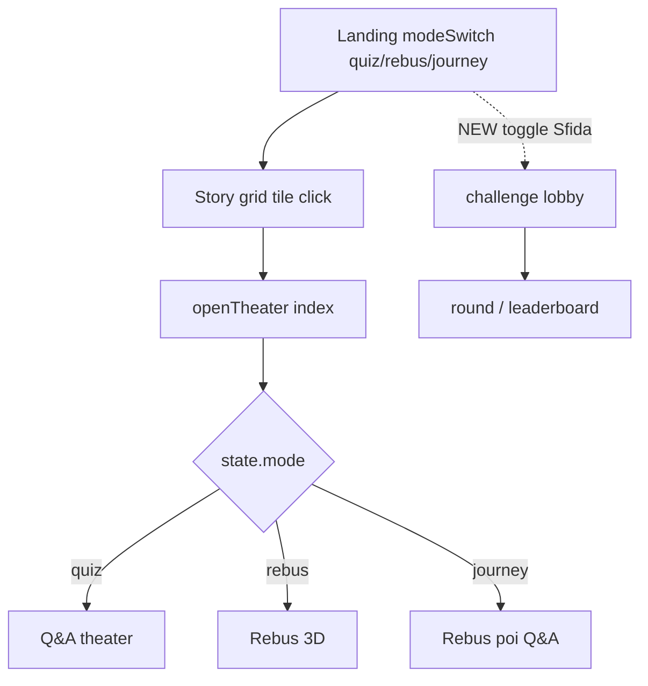

# Multiplayer MVP Spec — Sfida locale 2–8 (Prompt J)

**Data:** 2026-09-30  
**Stato:** design freeze **APPROVATO** (HITL D-J1…D-J4)  
**HEAD base:** `bf78e84` (fix ResourceManager Ep13 incluso)  
**Superficie:** `webapp/index.html` only (no `app.js`, no `episodes.json`)

---

## 0. Pre-flight (evidenza)

| Check | Risultato |
|-------|-----------|
| `git status --short` | vuoto |
| History fix asset | `7054c1c` registra resx; `bf78e84` kb residui |
| Ep13 V[4] ≠ 2753 | `.local/smoke/j_preflight_ep13.png` (= `fix_ep13_v4_slot.png`); pixel_dist **277.53** |
| `GetObject(piccolo_gregge)` | True (log `fix_ep13_getobject.txt`) |

### Insertion point (codice esistente)



| Luogo | File:riga (approssimata) | Uso per Sfida |
|-------|--------------------------|---------------|
| Mode switch | `index.html` `#modeSwitchNav` / hero, `renderModeSwitch` | Accanto: toggle «Sfida» (non 4ª modalità) |
| `setMode` | `setMode` | Non alterare MODES; Sfida = flag overlay; disabled in journey |
| Grid tile → `openTheater` | grid click / `openTheater` | In sessione Sfida: lobby/round, non openTheater diretto |
| i18n | `UI.it` / `UI.en` in `index.html` | Prefisso `ch_*` |
| Sanitize nome | `sanitizePlayerName` | Riuso lobby giocatori 2–8 |
| Player 1 default | `jwquiz_player_name_v1` | Host display name (read-only) |

`story-i18n.js`: localizzazione **storie**, non chrome UI. Challenge strings → `UI.it`/`UI.en`.

---

## 1. Flusso utente

1. Landing → scegli modalità **Quiz** o **Rebus 3D** (Avventura: Sfida **disabled** — D-J1 A).
2. Toggle **Sfida** ON → `#challenge-lobby`.
3. Lobby: nomi 2–8, timer, **sequenceMode**, Avvia.
4. Round N (da `sequenceEpisodes`): timer **per-player**; risposte; fine → soluzione + morale + classifica.
5. Round successivi o classifica finale → **Nuova sfida** / Esci.

```text
Landing → mode (quiz|rebus) → [Sfida ON] → Lobby → Round(s) → Leaderboard → Esci / Nuova sfida
```

---

## 2. Lobby

| Regola | Dettaglio |
|--------|-----------|
| Giocatore 1 (host) | `localStorage.jwquiz_player_name_v1` o fallback `Ospite` / `onb_guest` |
| Giocatori 2–8 | input text; `sanitizePlayerName` |
| Min / Max | **2** / **8** |
| Timer | 10–30s (default **15**), applicato **per player** |
| Avventura | toggle Sfida **disabled** se `state.mode === "journey"` |

### sequenceMode (D-J2 D) — host sceglie sequenza

| Mode | Comportamento | Round default |
|------|---------------|---------------|
| `preset` | `[1, 2, 3]` | 3 |
| `mixed` | 3 id random **distinct** da `1..23` | 3 (D-J2b) |
| `single` | `[episodio scelto]` — dropdown anti-spoiler (`Episodio {id}` + tema, **no titolo**) | 1 |

---

## 3. Round

| Regola | Dettaglio |
|--------|-----------|
| Timer | **Per-player** (D-J3 B): N countdown indipendenti = `timerSec` ciascuno |
| Mode round | uguale a `state.mode` (quiz **o** rebus) |
| Anti-spoiler | header: `Episodio {id}` + tema; **mai** titolo |
| Chiusura | tutti `answered` **oppure** ogni player scaduto/risposto |
| Timeout player | `{ ok: false, timeMs: timerSec*1000, xpDelta: 0 }` |
| Soluzione | **solo** a fine round |
| Rebus | theater/rebus riuso dove possibile; hint tracked (policy A) |
| Quiz | domande da `JW_IMMERSIVE` / `STORIES[].questions` |

---

## 4. Scoring

| Voce | Punti |
|------|------:|
| Base corretta | +100 |
| Bonus velocità | +0…+50 **per-player**: lineare su *quel* countdown (`t=0` → +50; `t=T` → +0) |
| Primo corretto | +50 al primo `ok` in **wall-clock** del round |
| No-hint (rebus) | +20 se quel player non ha usato hint (hide non ripristina — policy A) |
| Streak | +10 per round consecutivo corretto, **cap +50** |
| Errato / timeout | **0** (mai negativo) |

**Policy A:** hint usato → no bonus no-hint anche dopo hide.

---

## 5. Classifica

1. **XP desc**.
2. Tie-break: n. corrette desc → `avgTimeMs` asc.
3. Fine round: classifica + soluzione + morale.
4. Fine sessione: `completed: true`.

---

## 6. Storage `jwquiz_challenge_v1`

```json
{
  "version": 1,
  "sessionId": "uuid-or-timestamp",
  "createdAt": "ISO-8601",
  "mode": "quiz|rebus",
  "timerSec": 15,
  "sequenceMode": "preset|mixed|single",
  "sequenceEpisodes": [1, 2, 3],
  "completed": false,
  "phase": "lobby|round|between|done",
  "roundIndex": 0,
  "players": [
    { "id": "p1", "name": "…", "xp": 0, "correct": 0, "streak": 0, "avgTimeMs": 0, "timesSumMs": 0, "answered": 0 }
  ],
  "rounds": [
    {
      "episodeId": 1,
      "mode": "quiz",
      "hintUsedBy": {},
      "answers": {
        "p1": { "ok": true, "timeMs": 1200, "first": true, "xpDelta": 150 }
      }
    }
  ]
}
```

| Operazione | Comportamento |
|------------|---------------|
| Nuova sfida | `removeItem("jwquiz_challenge_v1")` |
| Reload | se `completed === false` → riprendi fase corrente |
| Separazione | **solo** write/delete su `jwquiz_challenge_v1`; `jwquiz_player_name_v1` **read-only** |

**Chiavi intoccabili (write/delete):**  
`jwquiz_onboarding_v1`, `jwquiz_player_name_v1`, `jwquiz_audio_v1`, `jwquiz_motion_v1`, `jwquiz_admin_session`.

---

## 7. UI / i18n

| Elemento | Note |
|----------|------|
| `#challenge-lobby` | hidden default; include radios sequenceMode + dropdown single |
| `#challenge-round` | hidden; **N timer** affiancati |
| `#challenge-leaderboard` | hidden |
| Toggle Sfida | `#modeSwitchNav` (+ hero); disabled in journey |
| i18n | `UI.it.ch_*` / `UI.en.ch_*` incl. `ch_seqPreset` / `ch_seqMixed` / `ch_seqSingle` |

---

## 8. Non-goals

- No backend, chat, secret, audio multiplayer dedicato.
- No 4ª modalità: Sfida = **layer** su Quiz/Rebus.
- No edit `data/episodes.json`, `app.js`, `analytics.js`, `StoryLibrary.cs`, `wrangler.toml`.
- No deploy; no commit `www/**`, `.local/**`.

---

## 9. Checklist implementazione

1. Markup sezioni + CSS.
2. State machine: `idle → lobby → round → between → done`.
3. Persist/load `jwquiz_challenge_v1` (`version:1`).
4. Wire toggle; disable in journey.
5. Round quiz + rebus (hint / policy A).
6. Scoring + leaderboard.
7. Smoke M1–M16 + X1–X9.

---

## 10. Decisioni finali (HITL 2026-09-30)

| # | Decisione | Scelta |
|---|-----------|--------|
| **D-J1** | Ambito modalità | **A** — Sfida solo **quiz** e **rebus** (no journey) |
| **D-J2** | Sequenza episodi | **D** — host sceglie `preset` \| `mixed` \| `single` |
| **D-J2b** | Round default | **3** (preset/mixed); single = 1 |
| **D-J3** | Timer | **B** — timer **per-player** |
| **D-J4** | Schema storage | **B** — schema + `version: 1` (+ `sequenceMode`, `sequenceEpisodes`) |

---

## Commit

```text
docs(design): multiplayer MVP spec (HITL D-J2/D-J3)
feat(challenge): multiplayer locale 2-8 (MVP)
```
