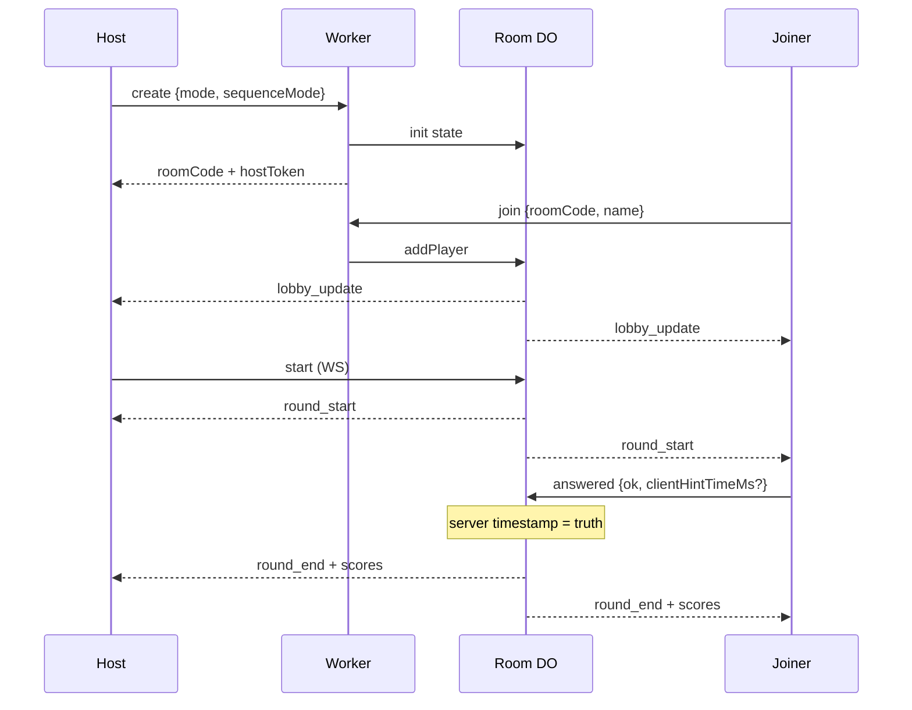

# Online Rooms Design — Durable Objects + WebSocket

**Data:** 2026-09-30  
**Stato:** design only — **NON implementare**  
**HEAD base:** `99f7e59` (Sfida locale MVP chiusa)  
**Prerequisito locale:** `docs/MULTIPLAYER_MVP_SPEC.md` (HITL D-J1…D-J4; `jwquiz_challenge_v1` `version:1`)  
**Infra oggi:** `wrangler.toml` = Pages + KV `JWQUIZ_DATA` + R2 `JWQUIZ_UPLOADS` — **nessun** Durable Object binding ancora.

---

## 0. Obiettivo

Estendere la **Sfida** da stesso-dispositivo a **room online 2–8** mantenendo:

- Layer su Quiz/Rebus (no journey) — D-J1  
- `sequenceMode` preset|mixed|single — D-J2  
- Timer **per-player** — D-J3  
- Anti-spoiler: tile = episodio + tema  
- Nessun account utente; **room code = auth**  
- `ADMIN_SECRET` **mai** riusato per room (resta solo admin analytics — `functions/api/analytics.js`)

Fallback obbligatorio: se DO/WS down → UI degrada a **Sfida locale** (`jwquiz_challenge_v1`).

---

## 1. Room lifecycle

```text
create → lobby → round → between → done → cleanup
```

| Fase | Chi | Azione |
|------|-----|--------|
| **create** | Host | `POST /api/room/create` → Worker istanzia DO; ritorna `roomCode` (6 char) + `hostToken` |
| **lobby** | Host + joiners | Join via code; nomi sanitizzati; host setta `mode`, `sequenceMode`, `timerSec` |
| **round** | Server | Broadcast `round_start`; timer per-player **server-side**; collect `answered` |
| **between** | Server | Soluzione + morale + classifica parziale; host `next_round` o auto |
| **done** | Server | `completed=true`; classifica finale; no nuovi join |
| **cleanup** | Alarm DO | TTL **2h** da `createdAt` o 30 min dopo `done` → `deleteAll` / destroy |

### Room code

- 6 caratteri `[A-Z2-9]` (no `0/O/1/I`) → ~1.07×10⁹ spazio  
- Mapping: `idFromName("room:"+code)` → un DO per room  
- Rate limit (Worker edge): **10 create/h/IP**, **50 join/h/IP** (KV counter o Cache API)



---

## 2. Room state schema (DO storage)

Allineato a locale `jwquiz_challenge_v1` + campi rete:

```json
{
  "version": 1,
  "roomId": "ABC2XY",
  "hostId": "p1",
  "hostTokenHash": "sha256…",
  "createdAt": "ISO-8601",
  "expiresAt": "ISO-8601",
  "status": "lobby|round|between|done",
  "mode": "quiz|rebus",
  "sequenceMode": "preset|mixed|single",
  "sequenceEpisodes": [1, 2, 3],
  "timerSec": 15,
  "roundIndex": 0,
  "catalogSha256": "<source-sha256 di data/episodes.json>",
  "players": [
    {
      "id": "p1",
      "name": "…",
      "xp": 0,
      "correct": 0,
      "streak": 0,
      "avgTimeMs": 0,
      "connected": true,
      "lastSeenAt": "ISO-8601"
    }
  ],
  "rounds": [
    {
      "episodeId": 1,
      "mode": "quiz",
      "startedAtServer": 0,
      "hintUsedBy": {},
      "answers": {
        "p1": { "ok": true, "timeMs": 1200, "first": true, "xpDelta": 150 }
      }
    }
  ],
  "completed": false
}
```

| Campo | Note |
|-------|------|
| `catalogSha256` | Stesso hash già emesso da `generate_story_artifacts.py` / header `stories.js` — audit replay |
| `hostTokenHash` | Token opaco al create; solo hash in DO; header `X-Host-Token` per start/config |
| `timeMs` in answers | **Solo** `serverNow - startedAtServer` (anti-cheat); client time ignorato per scoring |

Persistenza: SQLite-backed DO (required su Workers Free — [CF DO pricing](https://developers.cloudflare.com/durable-objects/platform/pricing/)).

---

## 3. Timer per-player via WebSocket

### Messaggi client → server

| Type | Payload | Chi |
|------|---------|-----|
| `hello` | `{ playerId, name?, hostToken? }` | tutti |
| `lobby_config` | `{ sequenceMode, timerSec, singleEpisodeId? }` | host |
| `start` | `{}` | host |
| `answered` | `{ playerId, ok, choiceKey? }` | player |
| `hint_used` | `{ playerId }` | player (rebus; policy A) |
| `next_round` | `{}` | host |
| `leave` | `{}` | player |

### Messaggi server → all (broadcast)

| Type | Payload |
|------|---------|
| `lobby_update` | `{ players, config }` |
| `round_start` | `{ episodeId, theme, mode, timerSec, serverStartedAt, antiSpoilerLabel }` — **no title** |
| `player_answered` | `{ playerId }` (senza ok mid-round se anti-peek) |
| `round_end` | `{ answers, xpDeltas, solutionTitle, moral, leaderboard }` |
| `error` | `{ code, message }` |
| `room_closing` | `{ reason: "ttl"|"done"|"host_gone" }` |

### Chiusura round (server)

1. Alla `round_start`: per ogni player `deadline[pid] = startedAtServer + timerSec*1000`.  
2. Su `answered`: se `serverNow <= deadline` → record; altrimenti forza timeout.  
3. Alarm DO a `max(deadline)` **o** check su ogni message.  
4. Round chiude quando **tutti** answered/scaduti.  
5. Scoring = stessa tabella locale (100 + speed + first + no-hint + streak) con `timeMs` server.

**Hibernation:** usare WebSocket Hibernation API per non tenere wall-clock duration per tutta la partita idle ([CF note](https://developers.cloudflare.com/durable-objects/platform/pricing/) — accept() senza hibernation fattura duration).

---

## 4. Anti-spoiler

Invariato rispetto a locale (`MULTIPLAYER_MVP_SPEC.md` §3):

- `round_start` e lobby episode picker: `Episodio {id}` + `tema`  
- Titolo solo in `round_end.solutionTitle`

---

## 5. `source-sha256` catalogo

- Al `create`, Worker legge costante build-time o KV key `catalog_sha256` popolata in deploy da CI (`stories.js` header oggi: `source-sha256: …`).  
- Salvato in room state.  
- Client: se sha locale ≠ room → warn “catalogo diverso; risultati non confrontabili” (non hard-block MVP).

---

## 6. Fallback → Sfida locale

| Condizione | Comportamento UI |
|------------|------------------|
| `fetch create` fail / 429 | Toast + resta su toggle Sfida locale |
| WS disconnect > N s in lobby | “Modalità online non disponibile” → lobby locale |
| WS drop mid-round | Tentativo reconnect (fase 4); se fail → **non** auto-completare XP online; offri “Continua offline (locale)” clonando snapshot last `lobby_update` in `jwquiz_challenge_v1` |

Storage locale **non** mescolato: online state vive solo in DO; clone offline = nuova sessione `jwquiz_challenge_v1`.

---

## 7. Auth / sicurezza

| Regola | Dettaglio |
|--------|-----------|
| No account | Room code + optional `hostToken` |
| `ADMIN_SECRET` | **vietato** su room routes; analytics resta isolato |
| Sanitize nomi | Stesso `sanitizePlayerName` (client) + re-sanitize server |
| No chat libera | Solo event protocol sopra |
| Rate limit | 10 create/h/IP, 50 join/h/IP |
| Host leave | Se host disconnect > 120s in lobby → promote oldest joiner **o** close room (proposta default: **close** se lobby; **promote** se round già iniziato) |

---

## 8. Costi / stima

Fonte: [Cloudflare Durable Objects pricing](https://developers.cloudflare.com/durable-objects/platform/pricing/) (pagina aggiornata 2026-09-30).

### Assunzioni scenario JW Quiz (documentate)

| Parametro | Valore |
|-----------|--------|
| Sessioni/giorno | **100** |
| Player medi/room | **4** |
| Round/sessione | **3** |
| Msg WS/player/round | ~6 (start, hint?, answer, end echoes) |
| Durata attiva JS/room | ~8 min wall (con hibernation tra round) |

### Free plan (giornaliero)

| Dimensione | Free/day | Stima uso/day (100 room) | Margine |
|------------|----------|--------------------------|---------|
| Requests (HTTP+WS+alarms; WS in ÷20) | 100 000 | create+join ~500 HTTP; WS msg ~100×4×3×6=7200 → billable ≈ 7200/20=360; tot ≪ 5k | OK |
| Duration GB-s | 13 000 | 100 room × 480 s × 0.128 GB ≈ **6 144 GB-s** | OK se hibernation |
| SQL rows read/write | 5M / 100k write | state piccolo | OK |

**Conclusione stima:** 100 sessioni/gg **sta nel Free** se si usa **WebSocket Hibernation** e SQLite DO.  
Se WS restano `accept()` senza hibernation per 8 min × 100: duration sale e può sforare Free → allora Workers Paid (include 400k GB-s/mo + $5 min).

### Paid (solo se serve)

Formula richiesta billable ≈ HTTP + (WS_in / 20).  
Esempio CF “hibernation broadcast” mostra che duration è il costo dominante senza hibernation — **obbligo design: hibernation on**.

Egress Pages/Worker: messaggi piccoli JSON (<1 KB); trascurabile vs DO compute a questo volume.

---

## 9. Piano rollout (4 fasi)

| Fase | Deliverable | Gate |
|------|-------------|------|
| **1 Skeleton** | Worker route create/join; DO empty state; WS hello/lobby_update; room code TTL alarm | 2 browser join stesso code |
| **2 Round** | `start` → `round_start` anti-spoiler; timer server; `answered`; `round_end` senza scoring XP | M-online: 3 player close round |
| **3 Scoring** | Port scoring J + streak + first + catalogSha256; leaderboard | Parity con dump locale su stessi input |
| **4 Reconnect** | Resume by roomCode+playerId soft cookie; host promote; fallback locale | Kill tab mid-round → rejoin < 30s |

Nessuna fase tocca `app.js` / `episodes.json`. UI entry: toggle “Online” accanto a Sfida in `index.html` (implementazione futura).

---

## 10. Rischi

| Rischio | Impatto | Mitigazione |
|---------|---------|-------------|
| Reconnect mid-answer | Doppio submit | idempotent `answers[pid]` |
| Host disconnesso | Room bloccata | promote o close (§7) |
| Race first-correct | Due “first” | lock su DO single-threaded; first = primo `answered` ok processato |
| Latenza cross-region | timeMs gonfio | DO location hint; accettare ±RTT; non usare client clock |
| Catalog drift | Soluzioni diverse | `catalogSha256` warn |
| Cheat choice peek | OK in clear text | Quiz: randomize choice order per player; optional answer hash later |
| Cost overrun | Bill shock | Hibernation + Free monitor; feature flag offline-only |
| Abuse room spam | DO noise | rate limit IP + TTL 2h |

---

## 11. Non-goals

- No chat, no voice, no friend list  
- No login / OAuth  
- No modifica scoring policy A stelle desktop  
- No deploy in questo documento  
- No binding DO finché Fase 1 non approvata HITL  

---

## 12. HITL follow-up (online) — dopo brand

| # | Domanda | Default |
|---|---------|---------|
| R1 | Abilitare Online su Free only vs Paid ready? | Free + hibernation |
| R2 | Host leave: close vs promote in-round? | promote in-round; close in lobby |
| R3 | Max room size resta 8? | Sì |

**Questo doc non richiede OK immediato per brand.** Brand STOP = B1–B8 in `BRAND_IDENTITY_PROPOSAL.md`.
